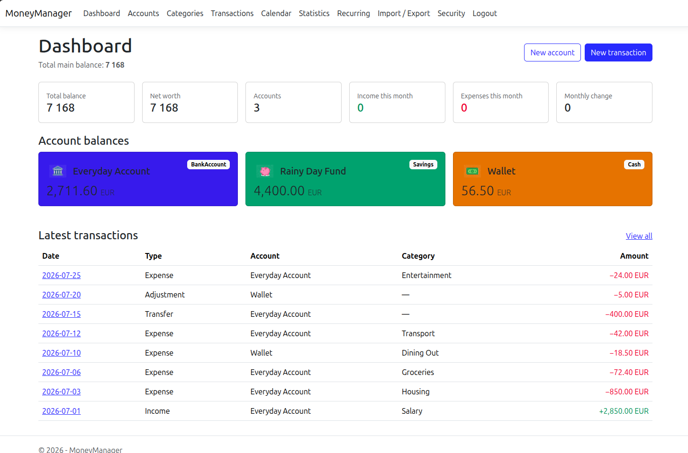
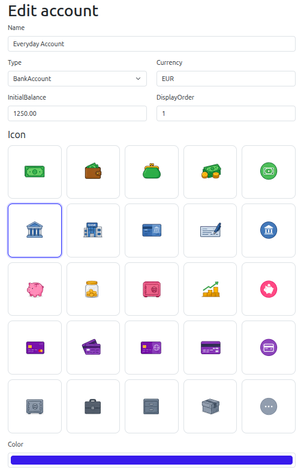
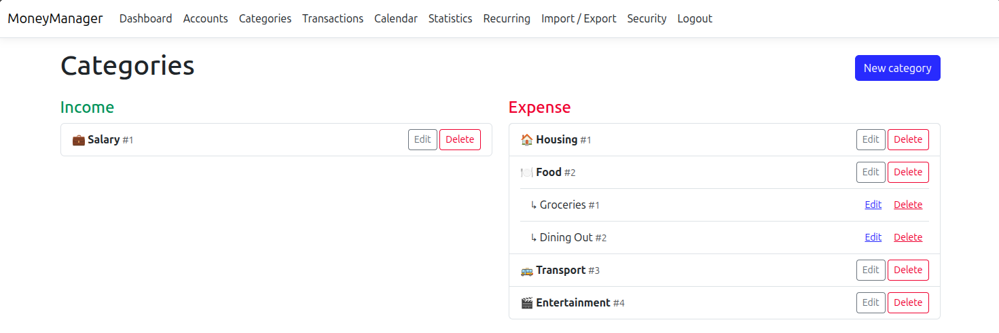
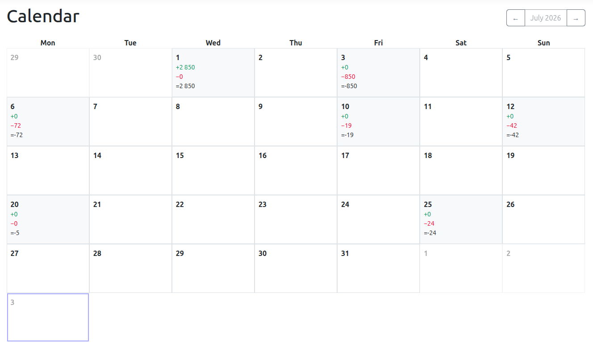
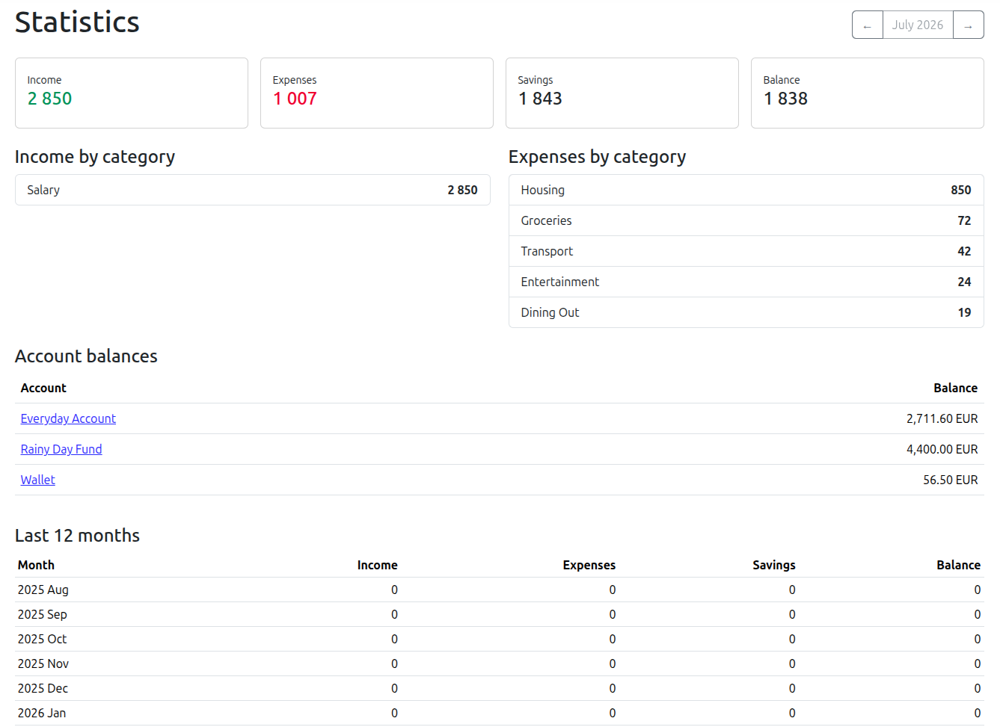

# PocketLedger

PocketLedger is a self-hosted personal finance manager built with ASP.NET Core MVC and PostgreSQL. It keeps accounts, categorized transactions, recurring entries, calendar views, statistics, and backups in one private installation.

> PocketLedger is intended for personal use and small trusted deployments. It is not accounting, tax, or financial advice software.

## Features

- Multiple cash, bank, savings, credit-card, and custom accounts
- Income, expense, transfer, and balance-adjustment tracking
- Hierarchical income and expense categories
- Dashboard, calendar, and monthly statistics
- Recurring transaction templates
- CSV transaction import and export
- Full JSON backup and restore
- Local user accounts with mandatory TOTP two-factor authentication
- Per-user data isolation and configurable user limit
- Docker Compose deployment with PostgreSQL

## Screenshots

### Dashboard



### Account editor



### Categories



### Calendar



### Statistics



## Basic workflow

1. Create accounts for the places where you keep money, such as a current account, savings account, credit card, or cash wallet.
2. Create income and expense categories. Categories may contain one level of subcategories.
3. Record income, expenses, transfers, and balance adjustments from the **Transactions** page.
4. Use **Recurring** for repeating income or expenses, and review scheduled activity in **Calendar**.
5. Explore monthly totals and category breakdowns in **Statistics**.
6. Use **Import / Export** to import transaction CSV files, export filtered transactions, or create a complete JSON backup.

PocketLedger supports three-letter currency codes such as `EUR`, `USD`, and `HUF`. Transfers can connect accounts that use the same or different currencies; for different currencies, enter both the source and target amount.

## User accounts

PocketLedger allows one registered user by default. Once the configured limit is reached, public registration is no longer available. Financial records are isolated by user, so increasing the limit does not give users access to each other's accounts or transactions.

For a Docker Compose installation, change this value in `.env` before starting or recreating the application container:

```dotenv
POCKETLEDGER_MAXIMUM_USER_COUNT=5
```

Then apply the updated configuration:

```bash
docker compose up -d app
```

For local development, set the same environment variable before starting PocketLedger:

```bash
export POCKETLEDGER_MAXIMUM_USER_COUNT=5
dotnet run --project src/PocketLedger
```

The default can also be changed in `AccountManagement:MaximumUserCount` inside `src/PocketLedger/appsettings.json`. Environment variables are recommended for deployments because they keep environment-specific settings out of source control. The accepted range is 1–100 users. Increase the limit only when every person allowed to register is trusted to use the installation.

## Try the demo data

A fictional dataset is included at [`examples/pocketledger-demo.json`](examples/pocketledger-demo.json). It contains sample accounts, categories, transactions, a transfer, a balance adjustment, and recurring entries. It contains no real personal or financial information.

To load it:

1. Start PocketLedger and sign in.
2. Open **Import / Export**.
3. Choose **Restore backup**.
4. Select `examples/pocketledger-demo.json`.
5. Review the preview, confirm the replacement, and restore it.

> Restoring a JSON backup replaces all PocketLedger finance data owned by the signed-in user. Export a backup first if the current data matters.

## Run with Docker Compose

### Requirements

- Docker Engine with Docker Compose v2
- An authenticator app that supports TOTP

### 1. Configure the deployment

Copy the example environment file:

```bash
cp .env.example .env
```

Edit `.env` and replace every placeholder. Use long, unique random values for both `POCKETLEDGER_INITIAL_PASSWORD` and `POSTGRES_PASSWORD`. The initial application password must be at least 14 characters long and contain uppercase and lowercase letters, a digit, a non-alphanumeric character, and at least eight unique characters.

PocketLedger-specific Docker and bootstrap settings use the `POCKETLEDGER_*` variable prefix.

### 2. Create the database and initial user

Start PostgreSQL:

```bash
docker compose up -d database
```

Apply the database migrations and create the initial user:

```bash
docker compose run --rm app bootstrap-identity
```

### 3. Start PocketLedger

```bash
docker compose up -d app
```

Open `http://localhost:5050`, or the port selected with `POCKETLEDGER_PORT`, and sign in with the initial username and password. PocketLedger will immediately require TOTP setup and display one-time recovery codes. Store those codes somewhere safe before continuing.

Useful container commands:

```bash
docker compose logs -f app
docker compose ps
docker compose down
```

`docker compose down` preserves the PostgreSQL named volume. Adding `--volumes` deletes the database volume and all application data.

## Build and run locally

### Requirements

- .NET 10 SDK
- PostgreSQL 17 or another PostgreSQL version supported by the configured EF Core provider
- An authenticator app that supports TOTP

### 1. Prepare PostgreSQL

Create a PostgreSQL database and user. The default development configuration expects:

```text
Host=localhost;Port=5432;Database=moneymanager;Username=moneymanager;Password=moneymanager
```

For anything other than an isolated local development machine, override it instead of using the development password:

```bash
export ConnectionStrings__DefaultConnection='Host=localhost;Port=5432;Database=moneymanager;Username=moneymanager;Password=replace-with-a-strong-password'
```

### 2. Restore tools, migrate, and build

```bash
dotnet tool restore
dotnet restore tests/PocketLedger.Tests/PocketLedger.Tests.csproj
dotnet tool run dotnet-ef database update --project src/PocketLedger --startup-project src/PocketLedger
dotnet build PocketLedger.slnx -c Release --no-restore
```

### 3. Create an initial user

Set the bootstrap credentials in the current shell:

```bash
export POCKETLEDGER_INITIAL_USERNAME='demo-admin'
export POCKETLEDGER_INITIAL_PASSWORD='replace-with-a-strong-password'
dotnet run --project src/PocketLedger -- bootstrap-identity
```

Alternatively, omit the bootstrap command and register the first user from the web interface. Registration becomes unavailable when `POCKETLEDGER_MAXIMUM_USER_COUNT` is reached; its default value is `1`.

### 4. Run the application

```bash
dotnet run --project src/PocketLedger
```

Then open the URL printed by ASP.NET Core, normally `http://localhost:5050`.

## Create a release build

Publish a framework-dependent release:

```bash
dotnet publish src/PocketLedger/PocketLedger.csproj -c Release -o ./artifacts/publish /p:UseAppHost=false
```

Run the published application with a production connection string and environment:

```bash
export ASPNETCORE_ENVIRONMENT=Production
export ConnectionStrings__DefaultConnection='Host=localhost;Port=5432;Database=moneymanager;Username=moneymanager;Password=replace-with-a-strong-password'
dotnet artifacts/publish/PocketLedger.dll
```

Database migrations are applied automatically only when `Database__ApplyMigrationsOnStartup=true`. Otherwise run `dotnet-ef database update` as a separate deployment step.

## Build a container image manually

```bash
docker build -t pocketledger:local .
```

The image listens on port `5050` and requires a reachable PostgreSQL database. Docker Compose is the recommended local container workflow because it supplies the database, connection string, persistent volume, and health check.

## Backup and import behavior

- **CSV export/import** moves income and expense transactions. Imported rows must reference accounts and categories that already exist.
- **JSON backup/restore** moves accounts, categories, all transaction types, and recurring transaction templates.
- JSON backups do not contain account passwords, TOTP secrets, recovery codes, or authentication audit events.
- JSON backups contain the complete financial dataset, including account names, balances, transaction amounts, dates, categories, and notes. Store and share backup files securely.

## Configuration reference

| Setting | Purpose | Default |
| --- | --- | --- |
| `POCKETLEDGER_PORT` | Host port used by Docker Compose | `5050` |
| `POSTGRES_DB` | PostgreSQL database name used by Docker Compose | `moneymanager` |
| `POSTGRES_USER` | PostgreSQL user used by Docker Compose | `moneymanager` |
| `POSTGRES_PASSWORD` | PostgreSQL password used by Docker Compose | Insecure fallback; always override |
| `POCKETLEDGER_INITIAL_USERNAME` | Username consumed by `bootstrap-identity` | None |
| `POCKETLEDGER_INITIAL_PASSWORD` | Password consumed by `bootstrap-identity` | None |
| `POCKETLEDGER_MAXIMUM_USER_COUNT` | Maximum number of local application users | `1` |
| `ConnectionStrings__DefaultConnection` | Application connection string | Development value only |
| `Database__ApplyMigrationsOnStartup` | Apply EF Core migrations when the process starts | `false` (`true` in Compose) |
| `HttpsRedirection__Enabled` | Enable application-level HTTPS redirection in production | `true` (`false` in Compose) |
| `ForwardedHeaders__KnownProxies__0` | First trusted reverse-proxy IP; add further numeric entries as needed | None |

## Project structure

```text
src/PocketLedger/           ASP.NET Core MVC application
tests/PocketLedger.Tests/   Automated tests
examples/                   Fictional importable demo data
docs/                       Operational documentation
compose.yaml                Application and PostgreSQL services
Dockerfile                  Multi-stage production image
```

## Development

Run the existing test suite with:

```bash
dotnet test PocketLedger.slnx
```

The .NET namespaces, assembly name, configuration keys, executable, solution, and project directories use the PocketLedger name. The existing PostgreSQL database and user defaults remain `moneymanager` so current Docker volumes continue to work without moving or recreating financial data.

## License

PocketLedger is available under the [MIT License](LICENSE).
