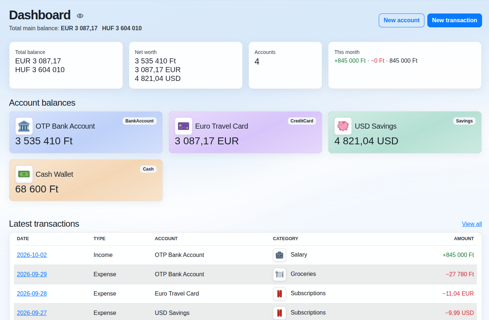
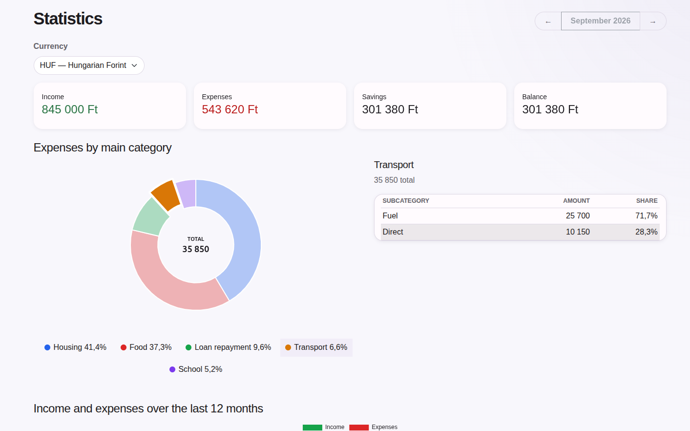
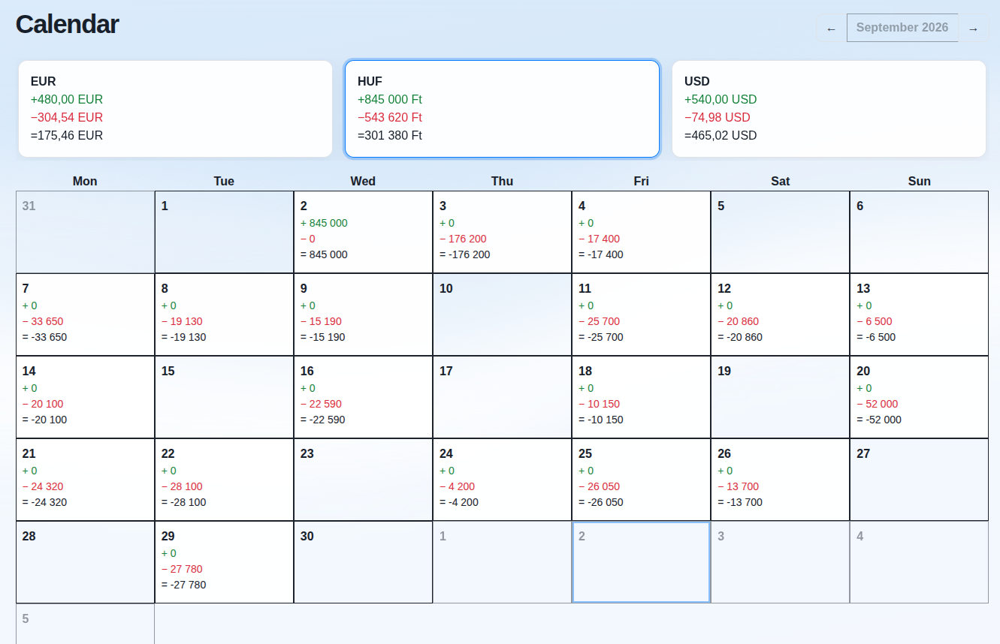
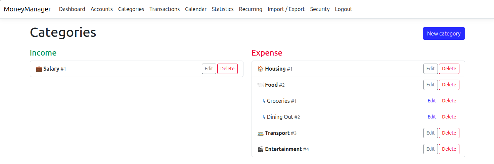

<div align="center">

# PocketLedger

**A self-hosted personal finance manager that keeps your money data encrypted, isolated, and yours.**

[](https://github.com/Adam23713/PocketLedger/actions/workflows/ci.yml)
[](https://github.com/Adam23713/PocketLedger/releases)
[](LICENSE)
[](https://dotnet.microsoft.com/)
[](https://www.postgresql.org/)

[Live demo](https://pocketledger.dev) · [Deployment guide](docs/deployment.md) · [Security docs](docs/) · [Report an issue](https://github.com/Adam23713/PocketLedger/issues)

</div>

<br>

PocketLedger is a self-hosted personal finance manager built with ASP.NET Core and PostgreSQL. It covers accounts, categorized transactions, recurring entries, loans and debts, a calendar view, statistics, CSV import, and password‑protected Excel export and backup/restore — all behind a security design where the database is encrypted at the field level, secrets never touch plaintext storage, and the whole deployment can sit behind an edge that rate-limits and bans abuse automatically.

> [!WARNING]
> **[pocketledger.dev](https://pocketledger.dev) is a live, work-in-progress deployment.** You're welcome to look around, but public registration isn't open yet — accounts are currently created by the operator. Self-service sign-up is coming soon. If you want to use PocketLedger today, [run your own instance](#quick-start-docker-compose); that's the primary way the project is meant to be used.

<br>

<div align="center">
<table>
<tr>
<td width="50%"></td>
<td width="50%"></td>
</tr>
<tr>
<td width="50%"></td>
<td width="50%"></td>
</tr>
</table>
</div>

## Why PocketLedger

- **Your data stays yours.** No ads, no analytics, no third party ever sees your transactions. Run it on your own VPS and that's the whole trust boundary.
- **Encrypted by default, not by configuration.** Sensitive fields — transaction notes, account and category names, debts, backups — are encrypted before they ever reach PostgreSQL. There's no "disable encryption" switch and no plaintext fallback.
- **Security that scales with how much you care.** Start with certificate-protected local keys, or move key custody to a cloud HSM (OCI Vault/KMS) — each step is documented and neither is required to get started. Whole-disk encryption (e.g. LUKS) is also an option if you want it, though it isn't part of the reference deployment.
- **A real edge, not just a reverse proxy.** The reference deployment puts Caddy and CrowdSec in front of everything, rate-limiting and automatically banning abusive traffic behind Cloudflare.
- **Built to be self-hosted.** Four independently deployable services, Docker Compose from day one, and no public self-registration — accounts are bootstrapped by whoever runs the instance.

## Features

| | |
| --- | --- |
| 💳 **Accounts & balances** | Bank accounts, cash, savings — each with its own currency, icon and color, with a live net worth and per-account balance. |
| 🧾 **Transactions** | Income, expenses, transfers and balance adjustments, organized into nested categories you define. |
| 🔁 **Recurring entries** | Set it once; a background worker posts recurring income and expenses on schedule. |
| 💸 **Loans & debts** | Track money owed to you and money you owe, separate from day-to-day cash flow. |
| 📅 **Calendar & statistics** | A monthly calendar of daily totals, plus category breakdowns and a 12‑month income/expense/savings trend. |
| 📥 **CSV import** | Bring in transactions from your bank's export. |
| 🔒 **Encrypted export & backup** | Transaction exports are password-protected Excel workbooks; full backup/restore uses an encrypted `.plbackup` file. |
| 🔐 **TOTP two-factor auth** | Every account is protected by an authenticator app and one-time recovery codes. |

## Architecture

PocketLedger runs as four independently deployed services, each with its own PostgreSQL database:

```text
PocketLedger.Landing    Public marketing site. No database, no auth.
PocketLedger.Web        Server-side Razor MVC app and browser-facing BFF.
                         The browser only ever sees an encrypted session cookie.
PocketLedger.Api        Owns all financial data. Accepts bearer tokens issued
                         by Identity. Runs the recurring-transaction worker.
PocketLedger.Identity   Owns users, credentials, TOTP, recovery codes, audit
                         events and the OpenIddict authorization server.
```

The Web process never touches the API or Identity database, and the API process never touches the Web or Identity database — each service's data stays behind its own service. Supporting class libraries live under `src/` (`Domain`, `Application`, `Contracts`, `Infrastructure`, `Security`).

<details>
<summary><strong>Recommended public URL topology</strong></summary>
<br>

```text
https://pocketledger.dev           Public landing page
https://app.pocketledger.dev       Web / BFF — what the browser talks to
https://api.pocketledger.dev       API — reserved for future first-party clients
https://identity.pocketledger.dev  Identity / OIDC
```

Caddy is the only published entry point; every application container is reachable only on the private Compose network behind it.

</details>

## Security at a glance

PocketLedger is designed so that no single layer is the only thing standing between your data and an attacker:

| Layer | What it protects | Details |
| --- | --- | --- |
| **Field-level encryption** | Transaction notes, account/category names, debts, backups, Identity secrets — encrypted before they reach PostgreSQL. No plaintext fallback on error. | [Database encryption guide →](docs/database-encryption.md) |
| **Cloud HSM key custody (optional)** | Hands key-wrapping for all three Data Protection key rings to an OCI Vault/KMS hardware security module, with one isolated key per service, encrypted `.enc` credential files, and a manual-unlock boot sequence. | [OCI KMS guide →](docs/oci-kms.md) |
| **Internal TLS** | Every hop to the API is encrypted with a private CA; a wrong or missing certificate fails closed. | [Internal API TLS →](docs/deployment.md#internal-api-tls) |
| **Edge protection** | Caddy + CrowdSec behind Cloudflare: trusted-IP-only rate limiting, automatic bans on flood/abuse patterns, redacted logs. | [Edge security guide →](docs/edge-security.md) |
| **Authentication** | TOTP-based two-factor auth and recovery codes for every account. No public self-registration — accounts are bootstrapped or managed administratively. | — |

Whole-disk encryption (for example LUKS) is a further option worth considering on top of this, but it isn't part of the reference deployment — see [Scope and guarantees](docs/database-encryption.md#scope-and-guarantees) for why key custody via OCI KMS was chosen here instead.

## Quick start (Docker Compose)

This is the short version for getting a first deployment running. For production hardening, domain setup, TLS, and the full encryption walkthrough, follow the **[complete deployment guide](docs/deployment.md)**.

**Requirements:** Docker Engine, Docker Compose v2, DNS records proxied by Cloudflare, and a TOTP authenticator app.

```bash
# 1. Copy the templates and fill in your domains and secrets
cp .env.example .env
cp Caddyfile.example Caddyfile

# 2. Generate the encryption keys, certificates and internal TLS material
sudo bash tools/initialize-encryption-keys.sh /opt/pocketledger-security
sudo bash tools/initialize-internal-tls.sh /opt/pocketledger-security

# 3. Build, bootstrap Identity, and start everything
docker compose build
docker compose up -d identity-database
docker compose run --rm identity bootstrap-identity
docker compose up -d
```

On first login, set up TOTP and save your recovery codes. See the [deployment guide](docs/deployment.md) for everything this skips over: generating secrets correctly, Cloudflare and CrowdSec configuration, activating OCI KMS, and moving an existing deployment to a new domain.

## Demo data

To explore PocketLedger with a realistic dataset, restore the checked-in **[encrypted demo backup](examples/demo-data-2026-june-august-multicurrency.plbackup)** after signing in to a local or disposable instance. It includes four HUF, EUR and USD accounts, categorized transactions from January through September 2026, recurring entries, loans and debts, and Monthly Planner data for October through December 2026.

1. Open **Import / Export → Restore backup**.
2. Select `examples/demo-data-2026-june-august-multicurrency.plbackup`.
3. Enter the demo password: `pocketledger-demo`.
4. Review the preview, explicitly confirm the replacement, and restore the backup.

> [!WARNING]
> Restoring a backup replaces all finance data belonging to the signed-in user. Use this demo only with an empty account or an instance whose existing data you do not need. The published password protects only this fictional dataset and must never be reused for a real backup.

The restore UI intentionally accepts only encrypted `.plbackup` files. The adjacent [JSON file](examples/demo-data-2026-june-august-multicurrency.json) is the human-readable source used to maintain the demo dataset; it cannot be uploaded directly through the application.

## Local development

```bash
dotnet tool restore
dotnet tool run dotnet-ef database update --project src/PocketLedger.Infrastructure --startup-project src/PocketLedger.Api --context PocketLedgerDbContext
dotnet tool run dotnet-ef database update --project src/PocketLedger.Identity --startup-project src/PocketLedger.Identity --context IdentityDbContext
dotnet tool run dotnet-ef database update --project src/PocketLedger.Web --startup-project src/PocketLedger.Web --context WebDbContext
dotnet build PocketLedger.slnx
```

This expects three local PostgreSQL databases (`pocketledger_web`, `pocketledger_api`, `pocketledger_identity`). Bootstrap the first identity, then run the three hosts in separate terminals:

```bash
export POCKETLEDGER_INITIAL_USERNAME='demo-admin'
export POCKETLEDGER_INITIAL_PASSWORD='replace-with-a-strong-password'
dotnet run --project src/PocketLedger.Identity -- bootstrap-identity

dotnet run --project src/PocketLedger.Identity
dotnet run --project src/PocketLedger.Api
dotnet run --project src/PocketLedger.Web
```

Development uses one checked-in signing key for interoperability — it is **not** a production secret. Run the landing page separately with `ASPNETCORE_ENVIRONMENT=Development dotnet run --project src/PocketLedger.Landing --urls http://localhost:5053`; it needs no database.

Build and test the whole solution with:

```bash
dotnet build PocketLedger.slnx
dotnet test PocketLedger.slnx
```

## API

All finance endpoints live under `/api/v1`; OpenAPI metadata is served at `/openapi/v1.json`. The API is currently designed for PocketLedger's own clients — compatibility is versioned at the URL, and generated public clients are intentionally deferred.

## Documentation

| Guide | Covers |
| --- | --- |
| [Deployment guide](docs/deployment.md) | Full VPS rollout: Compose, domains, TLS, secrets, subdomain migration, caching. |
| [Database encryption](docs/database-encryption.md) | Field-level encryption design, data classification, key rotation and recovery. |
| [OCI KMS](docs/oci-kms.md) | Moving key custody to an OCI Vault/KMS hardware module, activation and rotation. |
| [Edge security](docs/edge-security.md) | Caddy + CrowdSec configuration, Cloudflare trust boundary, verification and rollback. |

## License

PocketLedger is free and open-source software, licensed under the [GNU Affero General Public License v3.0 only](LICENSE) (`AGPL-3.0-only`).

Password-protected Excel export uses [EPPlus](https://github.com/EPPlusSoftware/EPPlus) under its Polyform Noncommercial license, configured here for noncommercial use. Using a modified PocketLedger distribution commercially — including as a paid product or service — requires either a commercial EPPlus license, replacing EPPlus with a suitably licensed component, or removing the Excel export feature. This requirement is separate from PocketLedger's own AGPL license.
